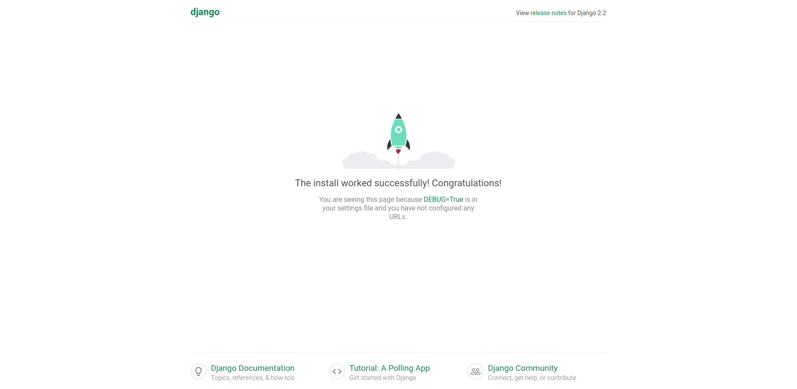

# 创建 Django 项目

## 1. 创建 Django 项目

- 在博客虚拟环境下，输入以下命令，就可以创建一个 Django 项目了：  
    **django-admin startproject blogproject**
- 输入命令后，将会在当前文件夹生成以下文件

    ```python
    blogproject
    ├── blogproject
    │   ├── __init__.py
    │   ├── settings.py
    │   ├── urls.py
    │   └── wsgi.py
    └── manage.py
    ```
- 接着我们进入到 **blogproject** 目录，输入：  
    **python manage.py runserver**
    就可以启动服务器了，可以看到以下提示信息：

    ```pyhton
    Watching for file changes with StatReloader
    Performing system checks...

    System check identified no issues (0 silenced).

    You have 17 unapplied migration(s). Your project may not work properly until you apply the migrations for app(s): admin, auth, contenttypes, sessions.
    Run 'python manage.py migrate' to apply them.

    August 05, 2020 - 12:18:40
    Django version 2.2.5, using settings 'blogproject.settings'
    Starting development server at http://127.0.0.1:8000/
    Quit the server with CONTROL-C.
    ```

    系统打印出这些信息，说明服务器启动成功了，打开浏览器，输入http://127.0.0.1:8000/ ，即倒数第2排信息提示我们的服务器地址。看到下面的界面：
    
- 此时，恭喜你，Django 成功运行。

## 2. 创建 APP

- 在 Django 中，一个 APP 代表一个功能模块。
    **python managy.py startapp <app_name>**
    在个人博客中，最重要的就是与文章相关的功能，所以要创建一个 APP ，来管理文章。
    **ython manage.py startapp article**
- 执行命令之后，会生成一个 article 文件夹.这是整个的项目文件应该是这样：

    ```python
    blogproject
    ├── article
    │   ├── admin.py
    │   ├── apps.py
    │   ├── __init__.py
    │   ├── migrations
    │   │   └── __init__.py
    │   ├── models.py
    │   ├── tests.py
    │   └── views.py
    ├── blogproject
    │   ├── __init__.py
    │   ├── __pycache__
    │   │   ├── __init__.cpython-36.pyc
    │   │   ├── settings.cpython-36.pyc
    │   │   ├── urls.cpython-36.pyc
    │   │   └── wsgi.cpython-36.pyc
    │   ├── settings.py
    │   ├── urls.py
    │   └── wsgi.py
    ├── db.sqlite3
    └── manage.py
    ```

- 项目文件目录分解如下：
  - **db.sqlite3** 是一个轻量级的 **数据库文件**，用来存储项目产生的数据，比如博客文章
  - **manage.py** 是项目执行命令的入口，比如runserver。
  - 目录 **article** 是刚创建出来的 app，用来放置博客文章相关的代码
    - 后台管理文件 admin.py
    - 数据模型文件 models.py
    - 视图文件 views.py
    - 存放数据迁移文件的目录 migrations
  - 目录 **my_blog**，其中的 settings.py 包含项目的 **配置参数**，urls.py 则是项目的 **根路由文件** 。

## 3. 注册 APP

- 创建 APP 后，我们需要告诉 Django ，新建了一个 APP。
- 打开 blogproject 目录的 **settings.py** ，找到 **INSTALLED_APPS** 写入如下代码：

    ```python
    INSTALLED_APPS = [
    # 其他代码
    ...
    # 新增 ‘article’ 代码，激活 app
    'article',
    ]
    ```

## 4. 配置访问路径

- 在 blogporject 的 **urls.py** 添加以下代码：

    ```python
    blogprojet/urls.py

    from django.contrib import admin
    ## 记得引入 include
    from django.urls import path, include

    urlpatterns = [
        path('admin/', admin.site.urls),

        # 配置 article 的 url
        path('article', include('article.urls', namespace='article')),
    ]
    ```

- 在 article 目录下，新建 **urls.py** 文件，新增以下代码：

    ```python
    from django.urls import path

    app_name = 'article'

    urlpatterns = [
        # 目前还没有 urls
    ]
    ```


